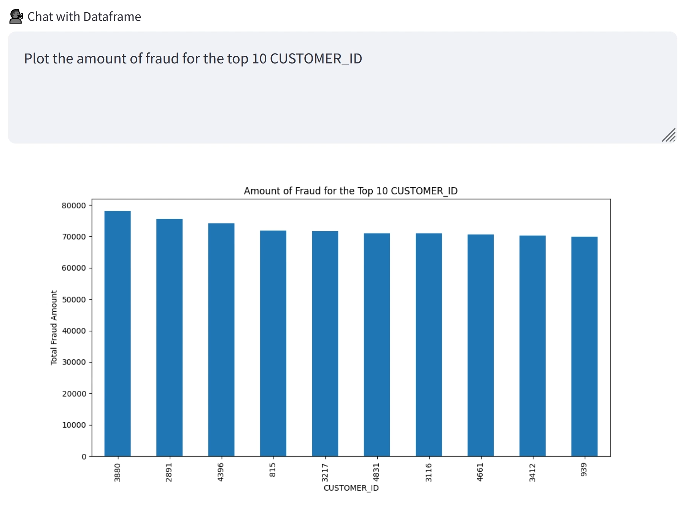

# 📊 BizInsight Pro — Intelligent Business Analytics Platform

> A production-grade, AI-powered business analytics platform built with Streamlit and Google Gemini.



---

## ✨ Features

| Category | Features |
|---|---|
| **Professional UI** | Dark-mode theme, custom CSS, animated KPI cards, responsive layout |
| **Data Upload** | CSV, Excel (.xlsx/.xls), JSON — up to 100 MB |
| **Auto-Detection** | Date, revenue, expense, and profit columns detected automatically |
| **KPI Dashboard** | Revenue, Expenses, Net Profit, Profit Margin, Growth Rates |
| **P&L Analysis** | Monthly/Quarterly/Yearly revenue vs expenses vs profit charts |
| **Trend Analysis** | Linear trend lines, period-over-period growth rates |
| **Anomaly Detection** | IQR and Z-Score methods with visual highlighting |
| **YoY Comparison** | Side-by-side comparison with a second uploaded dataset |
| **Depreciation** | Straight-line, declining-balance, sum-of-years schedules |
| **Forecasting** | Simple linear-regression forecast with configurable horizon |
| **AI Insights** | Executive summary, trend analysis, anomaly explanation, recommendations, comparative analysis, and a free-form Q&A — all powered by Google Gemini |
| **Visualizations** | Line, bar, area, scatter, pie/donut, heatmap, waterfall, correlation matrix |
| **Reporting** | PDF (ReportLab), Excel (openpyxl), and CSV exports |

---

## 🗂️ Project Structure

```
Business-analysis/
├── app.py                  # Main Streamlit entry point
├── config.py               # Constants and configuration
├── data_processor.py       # Data loading, cleaning, transformation
├── analytics.py            # KPIs, P&L, anomalies, YoY, forecasting
├── visualizations.py       # Plotly chart builders
├── ai_insights.py          # Google Gemini API integration
├── report_generator.py     # PDF and Excel report generation
├── ui_components.py        # Reusable Streamlit UI components
├── utils.py                # Formatting helpers and utilities
├── sample_data.csv         # Ready-to-use 3-year demo dataset
├── requirements.txt        # Python dependencies
├── .env.example            # Environment variables template
├── LICENSE                 # MIT licence
├── .streamlit/
│   └── config.toml         # Streamlit theme & server settings
└── assets/
    └── style.css           # Custom dark-theme CSS
```

---

## 🚀 Quick Start

### 1. Clone the repository

```bash
git clone https://github.com/jannicaSD/Business-analysis.git
cd Business-analysis
```

### 2. Create and activate a virtual environment

```bash
python -m venv venv
# macOS / Linux
source venv/bin/activate
# Windows
venv\Scripts\activate
```

### 3. Install dependencies

```bash
pip install -r requirements.txt
```

### 4. Set your Gemini API key

Copy the example env file and add your key:

```bash
cp .env.example .env
```

Edit `.env`:
```
GEMINI_API_KEY=your_actual_api_key_here
```

Or set the environment variable directly:

```bash
# macOS / Linux
export GEMINI_API_KEY="your_actual_api_key_here"

# Windows
set GEMINI_API_KEY=your_actual_api_key_here
```

> **Get a free Gemini API key** at [Google AI Studio](https://makersuite.google.com/app/apikey).

### 5. Run the app

```bash
streamlit run app.py
```

Open [http://localhost:8501](http://localhost:8501) in your browser.

### 6. Deploy to Streamlit Cloud (optional)

1. Push the repo to GitHub (already done).
2. Go to [share.streamlit.io](https://share.streamlit.io) → **New app**.
3. Select this repo, branch `main`, and set **Main file path** to `app.py`.
4. Under **Advanced settings → Secrets**, add:
   ```toml
   GEMINI_API_KEY = "your_actual_api_key_here"
   ```
5. Click **Deploy** — the app will be live in ~60 seconds.

---

## 📂 Supported Data Formats

| Format | Extension | Notes |
|---|---|---|
| CSV | `.csv` | Any delimiter auto-detected |
| Excel | `.xlsx`, `.xls` | First sheet used by default |
| JSON | `.json` | Records or columnar orientation |

**Recommended columns** (auto-detected):
- A date/time column (e.g. `date`, `period`, `month`)
- A revenue column (e.g. `revenue`, `sales`, `income`)
- An expense column (e.g. `expenses`, `cost`, `costs`)
- A profit column (optional — calculated automatically if missing)

> **🚀 Try it instantly:** upload the included `sample_data.csv` (576 rows, 9 columns — 3 years of multi-product, multi-region business data with injected anomalies).

---

## 🤖 AI Features (Gemini API)

After entering your Gemini API key in the sidebar, navigate to the **AI Insights** page for:

1. **Executive Summary** — C-suite-ready overview of business performance
2. **Trend Analysis** — Direction, strength, and momentum assessment
3. **Anomaly Explanation** — Root-cause hypotheses for flagged data points
4. **Strategic Recommendations** — Immediate, short-term, and long-term actions
5. **Forecast Insights** — Commentary on the simple forecast
6. **Comparative Analysis** — Deep dive when a comparison dataset is uploaded
7. **Ask AI** — Free-form question answering about your data

---

## 📑 Export Options

| Format | Contents |
|---|---|
| **PDF** | KPI table, statistics, all AI insight sections |
| **Excel** | KPIs sheet, Raw Data, P&L, YoY Comparison, Statistics |
| **CSV** | Filtered raw dataset |

---

## ⚙️ Configuration

Edit `config.py` to customise:
- Colour palette (`COLORS`, `CHART_COLORS`)
- Gemini model and generation settings
- Anomaly detection thresholds
- Default column name heuristics

---

## 🛡️ Security & Privacy

- API keys are read from environment variables or entered via a password-masked sidebar field — never hard-coded.
- Uploaded data is processed in-memory only; nothing is persisted to disk.
- Streamlit session state is isolated per user session.

---

## 📦 Requirements

- Python 3.10+
- See `requirements.txt` for the full dependency list.

---

## 📄 License

MIT — see [LICENSE](LICENSE) for details.
